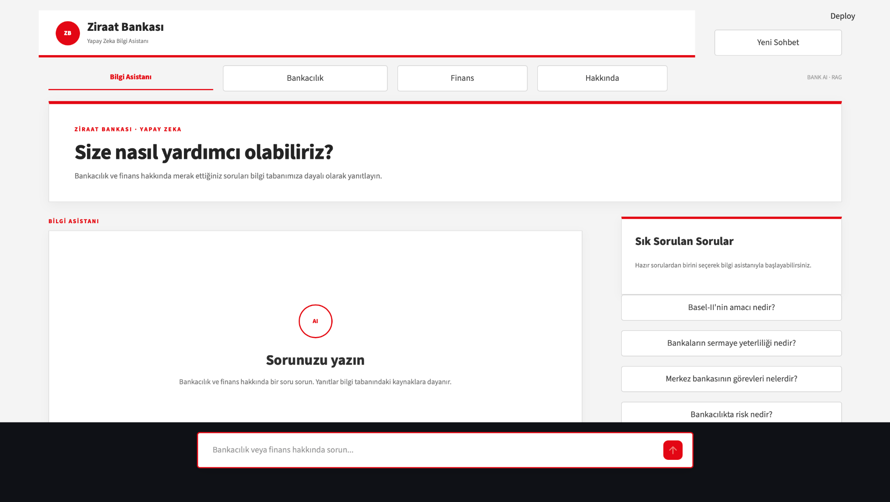
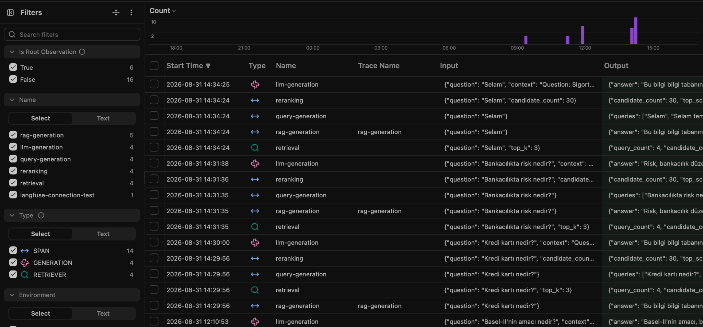

# Banking RAG System

A Retrieval-Augmented Generation (RAG) system developed during my AI internship to provide grounded answers to banking and finance-related questions.

## Overview

This project combines semantic embeddings, ChromaDB, query preprocessing, reranking, and an LLM to retrieve relevant information from a structured banking knowledge base and generate context-aware answers.

The system is implemented as a Streamlit-based AI assistant and uses Langfuse for observability and tracing of the RAG pipeline.

## RAG Pipeline

User Question
↓
Query Preprocessing
↓
Query Generation
↓
Embedding
↓
ChromaDB Retrieval
↓
Reranking
↓
Context Selection
↓
LLM Generation
↓
Grounded Answer + Sources

## Application

The project includes a Streamlit-based banking and finance information assistant.

Users can ask questions directly or select from predefined frequently asked questions. Responses are generated using information retrieved from the knowledge base, and supporting sources are displayed in the interface.

## Langfuse Observability

Langfuse is integrated into the application to monitor and trace the RAG pipeline.

The main pipeline components are tracked separately:

- Retrieval
- Query generation
- Reranking
- LLM generation
- RAG generation

The traces include inputs, outputs, retrieved sources, latency, and token/cost information.

## Technologies

- Python
- Streamlit
- ChromaDB
- Sentence Transformers
- all-MiniLM-L6-v2
- OpenAI API
- GPT-5-mini
- Langfuse
- Pandas

## Dataset

The knowledge base consists of structured banking and insurance question-answer data and chapter-end questions.

A total of 1,322 documents were indexed in ChromaDB.

## Retrieval Evaluation

The retrieval pipeline was evaluated progressively:

| Method | Top-1 | Top-3 | Top-5 |
|---|---:|---:|---:|
| Baseline | 26.25% | 42.50% | 51.25% |
| Metadata Filtering | 60.00% | 76.25% | 80.00% |
| Query Preprocessing | **65.00%** | **77.50%** | 78.75% |
| Same-Model Reranking | 65.00% | 77.50% | 78.75% |

Query preprocessing currently provides the best Top-1 retrieval performance in the evaluated experiments.

## Grounding

The system includes a grounding mechanism to reduce unsupported answers.

When relevant information cannot be found in the knowledge base, the system responds:

> "Bu bilgi bilgi tabanında bulunamadı."

This helps keep generated answers grounded in the retrieved knowledge base and reduces unsupported responses.

## Current Status

Completed:

- Data analysis and quality checks
- Data preparation
- Embedding generation
- ChromaDB vector database
- Semantic retrieval
- Metadata filtering
- Query preprocessing
- Query generation
- Retrieval evaluation
- Retrieval error analysis
- Threshold analysis
- RAG answer generation
- Grounding tests
- Reranking experiments
- Streamlit user interface
- Langfuse observability and tracing
- Session-based conversation tracking
- Source display in generated answers

## Project Structure

banking-rag-system/
├── README.md
├── .gitignore
├── docs/
│   └── images/
│       ├── bank-ai-app.png
│       └── langfuse-tracing.png
├── task7_data_analysis.py
├── task7_prepare_data.py
├── task7_create_chroma.py
├── task7_retrieval_test.py
├── task7_retrieval_evaluation.py
├── task7_retrieval_evaluation_filtered.py
├── task7_query_preprocessing.py
├── task7_rag_generation.py
├── task7_rag_grounding_test.py
├── task7_threshold_analysis.py
├── task7_reranking.py
├── task7_retrieval_error_analysis.py
└── task7_rag_app.py

## Project Status

Completed and functional.

The current version provides a complete RAG-based banking information assistant with retrieval, reranking, grounded answer generation, source display, conversation history, and Langfuse observability.
